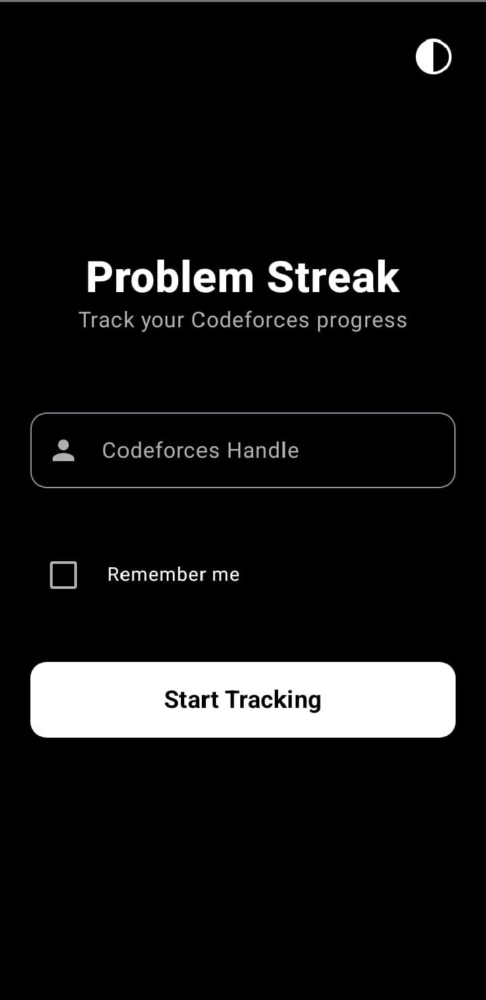
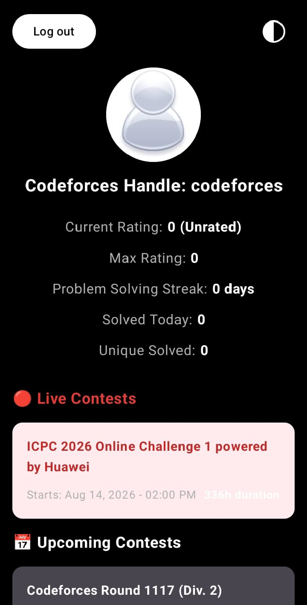

# Problem Streak 

**ProblemStreak** is a native Android application designed for competitive programmers on Codeforces. It helps users track their practice consistency, calculate unique problem counts, and stay updated with upcoming contests to foster a daily coding habit.

---

##  Screenshots

|                     Home Screen                     |                 Profile & Performance                  |
|:---------------------------------------------------:|:------------------------------------------------------:|
|  |  |

---

##  Features

**Streak Tracking:** Accurately calculates consecutive active days based on accepted submissions.
**Unique Solved Metrics:** Filters accepted (`OK`) verdicts and deduplicates problem submissions to show true problem count.
**Contest Schedules:** Fetches and displays upcoming and ongoing Codeforces contests.
**Reactive Data Flow:** Utilizes asynchronous streams for seamless UI updates.

---

##  Tech Stack & Architecture

* **Language:** Kotlin
* **Architecture:** Clean Architecture (Data, Domain, Presentation) + MVVM
* **UI Framework:** Jetpack Compose / Material Design 3
* **Dependency Injection:** Dagger Hilt
* **Asynchronous Programming:** Kotlin Coroutines & Flow
* **Networking & Serialization:** Retrofit / Ktor & `kotlinx.serialization`

---

##  Getting Started

### Prerequisites
* Android Studio Ladybug (or newer)
* JDK 17 or higher
* Android SDK Version 24+

### Installation

1. Clone the repository:
   ```bash
   git clone (https://github.com/Sameeh-Ekmail/Problem_Streak.git)